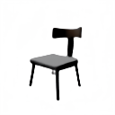
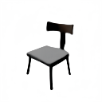
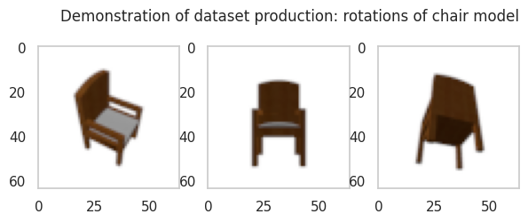
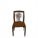
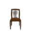
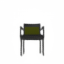
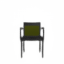
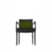
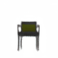
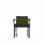

# Equivariant Neural Rendering

*Authors: Elias Dubbeldam, Aniek Eijpe, Orestis Gorgogiannis, Oline Ranum, Robin Sasse*

## Introduction

<!-- The paper from Dupont et al. introduces an approach to render 2D images into implicit, equivariant 3D representations. The authors argue that the scene representations need not be explicit, as long as the transformations to it occur in an equivariant manner. Their model is trained on a dataset of rotation symmetries, learning to produce novel views from a single image of a scene. -->

Current approaches in scene representations present difficulties with scalability. Voxel grids, point clouds and other traditional methods have high computational and memory requirements. Reconstrucion from incomplete or noisy data is also a challenging task with these methods, often requiring 3D information during training. Generating novel views of a scene given limited input views presents the same difficulties. Finally, traditional neural networks are not equivariant with respect to general transformation groups. 3D equivariance especially requires specifc techniques like steerable filters. Dupont *et al.* (2022) [1] attempt to solve these problems by proposing a new method which results in more scalable, implicit representations that are also equivariant with respect to transformations. 

The difference between an explicit scene representation (mesh grid) and an implicit one can be seen in Figure 1. While an explicit representation requires structural information of the 3D shape in great detail, the implicit representation is described by an uninterpretable three-dimensional tensor. While the numerical values of the implicit form are abstract and not meant for a human to understand, they provide significant advantages in terms of memory and computational efficiency. 

<p align="center">
   
   <br>
   <text><b><em>Figure 1. </b>Visualization of explicit (left) and implicit (right) scene representation. Taken from [1].</em></text>

</p>

To effectively use these implicit representations, the authors of the paper argue that the transformations applied to them have to be equivariant to the same transformations on an explicit representation.

  
### 1.1: Methodology
 
#### 1.1.1: Architecture

The proposed model uses a series of convolutions to map scene representations to images. Specifically, the scene representation is passed through 3D convolutions, followed by $1\times1$ convolutions and a set of 2D convolutions that maps them to image space. The reverse renderer is the transpose of this operation. As shown in Figure 2, an image is passed through the inverse render pipeline, creating the implicit 3D representation. Any transformation can be applied to this representation space, before following the forward renderer to obtain the recreated original, or transformed image.

Equivariance is enforced between representation and image space by applying transformations in both spaces. Because the representation space is a deep voxel grid, the transformations in this space are defined by a 3D rotation matrix. Because there is a chance that the rotated points may fall out of the reconstructed grid, inverse warping with trilinear interpolation is used in the model, to reconstruct the rotated values within the grid boundaries.

<!--  -->
<p align="center">
   
   <br>
   <text><b>Figure 2. </b><em>Model architecture. An image is processed by the inverse render (right-pointing arrow, rotated in the implicite scene representation (down-pointing arrow), and reversed back to an image by the rendered (left-pointing arrow). Taken from [1].</em></text>
</p>

#### 1.1.1: Training

As shown in Figure 4, two images of the same object, obtained from different camera angles, are passed through the inverse renderer and the implicit representations are formed. Then, the forward and backward transformation grid is applied to both latent representations to turn one into the other, before passing them to the renderer. Finally, the reconstructed output images are compared to the original inputs to obtain the loss values. Training in this manner ensures the model learns equivariant representations, as the loss evaluates both the actual rendering and the accuracy of the matching transformations from both spaces.

<!--  -->
<p align="center">
   
   <br>
   <text><b>Figure 3. </b><em>Model training, indicating how two images from the same scene are rotated and used for training. Taken from [1].</em></text>
</p>

Finally, the authors claim that the rendering loss used makes little change in results. They provide l1 norm, l2 norm and SSIM loss as candidates, and conduct ablation studies to determine the tradeoffs between them.

### 1.2: Datasets
The authors evaluate their model on 4 datasets, including two ShapeNet benchmarks as well as two novel datasets of the authors design. They use an image size of $128 \times 128$ and a representation size of $64 \times 32 \times 32 \times 32$. The datasets are presented in Table 1. 


| *Dataset*  | *Source*  |  *Sample* | *# Scenes*  |*# images per scene*| *# datapoints*|
|---|---|---|---|---|---|
| Chairs  | [ShapeNet](https://icml20-prod.cdn-apple.com/eqn-data/data/chairs.zip)  |   |  6591 | 50  | 329 550|
| Cars  |  [ShapeNet](https://icml20-prod.cdn-apple.com/eqn-data/data/cars.zip) |   |  3514 |  50 | 175 700|
| MugsHQ  |  [Apple](https://icml20-prod.cdn-apple.com/eqn-data/data/mugs.zip) |   |  214 | 150  | 32 100|
| 3D mountainset  |  [Apple](https://icml20-prod.cdn-apple.com/eqn-data/data/mountains.zip) |   |  559 |  50 | 27 950|

**Table 1.** _Overview of datasets considered for equivariant neural rendering by [1]._

### 1.3: Experiments of paper 

The experiments of the study are confucted mainly on ShapeNet benchmarks, as well as two novel datasets of their design. The proposed model is compared against three baseline models. All three built for 3D rendering from one or multiple 2D images, but they all make assumptions much stronger than the original study. Comparison off the assumptions between other SoTA models and the proposed model is presented in Table 2.

|   | TCO  |  DGQN | SRN  | Proposed model  |
|---|---|---|---|---|
| Requires Absolute Pose  | Yes  | Yes | Yes | No |
| Requires Pose at Inference Time  | No  | Yes | Yes | No |
| Optimization at Inference Time  | No  | No | Yes | No |

**Table 2.** _Comparison between assumptions of SoTA models._

The qualitative comparisons against the baseline models in single shot novel view synthesis with the ShapeNet chairs dataset, as shown in Figure 4, reveals that the model achieves similar to SoTA results while making far fewer assumptions than the other methods. It can produce high quality novel views by achieving the desired equivariant transformation in representation space.

<!--  -->
<p align="center">
   
   <br>
   <text><b>Figure 4. </b><em>Qualitative comparison of single shot novel view synthesis on the ShapeNet chairs dataset. Taken from [1].</em></text>
</p>

Experiments in other datasets include:

- Cars: the cars Shapenet class
- MugsHQ: a dataset of mugs based on the mugs ShapeNet class with an added background environment
- 3D mountains: a dataset of mountain landscapes

Results similar to the chairs were reported in the other datasets, with some variations due to the specific challenges of each one. For example, the mountains contain extremely complex geometric information, which severly limits the detail of the novel view synthesis. Instances of these are shown in Figure 5.

<p align="center">
    </br>
    </br>
    </br>
    </br>
   <br>
   <text><b>Figure 5. </b><em>Qualitative comparison with the different datasets. Taken from [1].</em></text>
</p>

Finally, the authors performed ablation studies to test novel view synthesis when using different loss functions. The results in each one were similar and no inherent prefered approach was suggested. In the end, they reason that choice of loss function is task specific. Their claim is supported by their experiments with different losses, showing minimal qualitative images in outputs.

### Loading, plotting & transforming the original image

The model infers from a single image and renders a second image from a novel view, as illustrated in the figures below.

<p align="center">
    
    
    </br>
   <br>
   <text><b>Figure 6. </b><em>Novel view synthesis by the original model (left rotations, middle translations, right roto-translations).</em></text>
</p>


## 2. Response 

Much of the success of deep learning can be attributed to effective representation learning. Such representations do not need to be humanly interpretable, but can also be abstract. The original authors proposed an implicit 3D representation of the scene, instead of an explicit 3D representation such as mesh-grids or point clouds. By removing the need for an explicit 3D representation, they developed a model that requires no 3D supervision. It only requires 2D images with the corresponding rotation angle of the camera, that was used between these images. Their model can generate a novel view from a different angle, given a single image. The qualitative results of their model’s performance motivated us to extent their research.

In the original paper the authors used 3D rotations to generate novel views, meaning that they rotate a camera on a sphere around the scene. 3D rotations do not act transitively on 3D space. Therefore, we proposed to extend their model to roto-translations, with the intermediate proof-of-concept step of using translations only. Roto-translations act transitively on 3D space, meaning that we can produce any possible camera angle. The full spectrum of rigid body motions are nescessary to produce satisfactory renderings of real world environments. For instance in applications such as virtual and agumented reality, and 3D reconstruction. Hence we hoped to obtain a model that can generate a novel view for any camera position in 3D space, within a reasonable range of movement.


###  What can the model do and what is missing?

The model, which was trained by the original authors, shows some nice out-of-the-box capabilities. That is the model can already perform some limited (roto-)translations.

#### Translations through inductive bias

Through inductive bias, (reasonably small) translations, which are orthogonal to the line of sight, already work on the model that has only been trained on rotations. This is due to the fact that the model uses a CNN architecture, which is translationally equivariant along the image plane. Due to the weight sharing property of the convolution kernels, a CNN will generally use the same encoding for the same image but with the same shift applied to the encoding, as shown in Figure 7. The same goes for the decoder (i.e. renderer) which will produce the same rendered image for a shifted reprensentation. Therefore, the model acts translationally equivariant for these kinds of shifts. Still, it seems interesting that the model does not seem to encode any information from the outside of the object to produce a good estimation.

<!--  -->

<!-- *. * -->

<p align="center">
    </br>
   <br>
   <text><b>Figure 7. </b><em>Illustration of translational equivariance in CNNs from [2]. Shifting the input and encoding it is equivalent to shifting encoding the input and shifting the encoding..</em></text>
</p>

Nonetheless, translations along the line of sight do not work out-of-the-box and require explicit training, as shown in Figure 8. The reason for that is that the equivariant neural rendering model considers the depth dimension via incorporating its information into the channels of the CNN. More concrete, the model uses the following code:

```python
# Reshape 3D -> 2D
reshaped = inputs.view(batch_size, channels * depth, height, width)
```

Furthermore, due to the central positioning of the objects in the images, the model has problems rendering scenes that extent to the image boundaries. Therefore, we trained our model on translations first, before moving on to roto-translations

#### Translations

<!--  -->

Another problem with out-of-the-box translations from the rotation model is that it only shifts the 2D image instead of developing a real 3D understanding of the scene. When we compare the rendered image to the ground truth, we observe that the model does not grasp that a shift also changes the angle at which the camera is looking at the object. It is obvious because the model has never seen a shift and only works on 2D equivariance as described above. Furthermore, we simply added a functionality for translations without ever training the model on them.

<!--  -->

<p align="center">
    </br>
    </br>
   <br>
   <text><b>Figure 8. </b><em>Examples how the original rotation-only model is able to perform trannslation orthogonal to the line of sight (bottom) but is not able to perform translations alon the line of sight (top).</em></text>
</p>


#### Roto-translations

We further observe that the same properties allow for out-of-the-box roto-translations. Also the roto-translations do not account for the angular shift between camera and object. This is shown in Figure 9.

<p align="center">
    </br>
   <br>
   <text><b>Figure 9. </b><em>Examples how the original rotation-only model is not able to perform translations along the line of sight.</em></text>
</p>

<!--  -->

#### In conclusion...

Their model has some useful capabilities for generating novel views including (roto-)translations. Nonetheless, upon thorough review, these translations do not reflect actual physics (relative rotational angle), nor are they complete (zoom and edge artifacts). We therefore need to train a model which can produce these novel views correctly.


## 3. Novel Contribution

In this section we describe the novel contributions of our research.

- We introduce a method to generate training data for the equivariant neural rendering models ([Section 3.1](#31-datasets)).

- We introduce a model that has been trained on translations and a model that has been trained on roto-translations ([Section 3.2](#32-extending-the-model)). This part constitutes the main contribution of our research.

### 3.1 Datasets

The authors present datasets consisting of rotational transformations. However, they do not provide instructions or tools for further data generation. To address this limitation we developed a new pipeline using blender for producing images of 3D-models under rotations, translations and roto-translations. Our pipeline can be used to increase the size of the training data, or to extend training data to new transformation groups.

The following section demonstrates the practical application of our pipeline for data production, by demonstrating how to use blender to generate new training data containing roto-translations.

#### 3.1.1  Demonstration: populating datasets using Blender 
Similar to [1], we perform experiments on the [ShapeNet Core](https://shapenet.org/download/shapenetcore)-Chairs benchmark. It is worth noting that the objects included in the ShapeNetCore dataset are already normalized and consistently aligned. However, the subsequent pipeline can be adapted to accommodate any 3D-object data that is processable by Blender. The notebook report contains a brief demonstration of how data can be constructed using Blender 3.5.1. Some examples are shown in Figure 10.

<p align="center">
    </br>
   <br>
   <text><b>Figure 10. </b><em>Examples of the dataset used for our novel contribution.</em></text>
</p>


#### 3.1.2 Populating new datasets

We use the afformention pipeline to build 3 new datasets: 

   * _Rotations_: used to reproduce the results presented by [1].
   * _Translations_: used to train a model with higher capacity for translation invariance.
   * _Roto-translations_: used to train a roto-translational invariant model.
    
The original datasets are recouse intensive to train, both from a computational and a memory perspective. Because our computational resources are limited, both in timeline and parallel GPU availability, we downscale the datasets in order to reduce the computational costs and therefore time of training the new models. For all three datasets we use the partitioning described in Table 2.


|   | **# Scenes**  |  **# Images per scene** | **Resolution**  | **# Total images**  |
|---|---|---|---|---|
| Train  | 2306  |  50 | 64 x 64  |  115300 |
| Validataion  | 331  | 50  |  64 x 64 | 16550  |
| Test  |  30 | 50  |  64 x 64 | 1500  |

**Table 2:** _Partition of new datasets_


| **Hyperparameter**  | **R**  |  **X** | **Y**  | **Z**  | **Resolution** |
|---|---|---|---|---|---|
|   | 1.5  | [-0.4, 0.4]  | [-0.3, 0.5]  | [-0.4, 0.4] | 64 x 64|

**Table 3:** _Hyperparameters used when populating the new dataset._

<!-- % Need to include rotations for training here, and fill in more info. -->

We construct the datasets by sampling poses from various views. In case of rotations the camera is placed on a sphere with a radius **R**. For each view, a value between 0 and $2\pi$ is uniformly sampled for the elevation and azimuth angle of the camera and rotated accordingly. In case of translations, for each view, a value is uniformly sampled from a range of **X**, **Y** and **Z** locations of the chair.


### 3.2 Extending the model

After evaluating the pretrained model supplied by [1], we extend the architecture to allow for translation matrices to be applied to the input image. Furthermore, by combining it with the previously implemented rotation matrix, we also allow for rototranslations. To combine these two symmetries, we use a single rototranslation matric and perform the operartion in one go.

### 3.3 Experiment Analysis

With these extentions to the model architecture, we conducted the following experiments:

#### 3.3.1 Retraining a rotation model with our dataset

With the dataset we created as discussed in [Section 3.1](#31-datasets), we tried training a rotation-based model from scratch, hoping to reproduce the authors' original results on our data. The resulting model outputs did not match up to the original model, as can be seen in Figure 11. Not an insignificant amount of detail is gone in the reconstructed image. We suspect the reason behind this loss in performance might be the reduced image size, as the same amount of error pixels will impact our new images more significantly. 

<!-- 

 -->

<p align="center">
    
    
    </br>
   <br>
   <text><b>Figure 11. </b><em>Novel view synthesis by our model trained on rotations (left rotations, middle translations, right roto-translations).</em></text>
</p>

<p align="center">
    </br>
   <br>
   <text><b>Video 1. </b><em>Training of rendering a new angle with our <b>rotation-only</b> trained model.</em></text>
</p>


#### 3.3.2 Training a translation model with our dataset

Our next experiment is to train a model focusing only on translations. As shown in [Section 3.2](#32-extending-the-model), the original model, which was pretrained on rotation data only, can already produce valid shifts for short distances along the image plane but not along the line of sight. We produced a translation dataset for the model to learn how to deal with more extensive shifts of the camera, as well as learning how to deal with shifts of any size along the line of sight. Because the depth dimension is encoded within the channels of the convolution layers, it is plausible that the model can learn to make use of this information to produce a zoom-like effect, similar to which one would expect when moving the camera closer to the object.

Since we can only cover a finite range of translations, we limit the range of shift to -0.4 and 0.4 for all directions. This value was chosen because it still leaves the chair mostly in the image and hence, still contains useful information for training and inference. 

As the figures below show, this model reconstructs the original image with very high accuracy. Its use is very limited, since it is only capable of portraying translations, but it can do so in all 3 axes.

<p align="center">
    
    
    </br>
   <br>
   <text><b>Figure 12. </b><emNovel view synthesis by our model trained on translations (left rotations, middle translations, right roto-translations).</em></text>
</p>

<!--  -->
<!--  -->

<!-- *** Depending on how our experiments go, we might need to talk about model architecture and more inductive biases here *** -->

In particular, we observe that the models capabilities of translations along the x-axis (scaling) has significantly increased after training upon the translation data. This is shown in Figure 13, where the model is able to zoom in on the chair, which was not possible with the original model.

<!-- 
 -->

<p align="center">
    </br>
    </br>
   <br>
   <text><b>Figure 13. </b><em>Results of rendering a new angle with our <b>translation-only</b> trained model.</em></text>
</p>

Video 2 shows that the training convergence is fast in this model, which we expected to be the case, as translations are a simpler symmetry form and require little information about the object's 3D structure.

<!--  -->

<p align="center">
    </br>
   <br>
   <text><b>Video 2. </b><em>Training of rendering a new angle with our <b>translations-only</b> trained model.</em></text>
</p>


#### 3.3.3 Roto-Translations

The motivation for our research was to extend the equivariant neural rendering model to be able to produce novel views for any camera position in 3D space. Roto-translations fulfill this requirement. More specifically, we can cover all 3D positions by limiting the azimuth angle to a range of -180 to 180 degrees and the elevation angle to a range of -90 to 90 degrees. The latter avoids a flipping of the camera which causes problems with the compatibility of translations in Blender vs translations in the model. Nonetheless, by being able to rotate the camera along the azimuth, we can still cover all necessary views. For translations, we can obviously only cover a finite distances, therefore we chose the same range as in section 3.2 (-0.4 to 0.4 for all directions). 

The results were not on par with the previous experiments. At first, the outputs were completely white and the object completely disappeared in the reconstructed image. Training results are shown in Video 3. 
<!-- We hypothesize that the model is not able to learn the roto-translations because the dataset is not large enough. The model is not able to learn the necessary features to produce a valid output. -->

<p align="center">
    </br>
   <br>
   <text><b>Video 3. </b><em>Training of rendering a new angle with our <b>roto-translations</b> trained model.</em></text>
</p>

<!--  -->

We performed an ablation study on the learning rate, hypothesizing that the features the model learns when a full rototranslation matrix is applied might need a less steep learning curve. We tested several values in the range of $[10^{-4}, 10^{-7}]$, but the output remained blank. 


Our conclusions on training a rototranslation model are that our data is not suficcient for this task. The experiment was unsuccessful and we hypothesize that there are not enough camera angles in our dataset for the model to leverage and construct an accurate representation. Using only 50 views for each scene might be too limiting to learn something as complex as rototranslations. To try and overcome this problem, we followed two different approaches.

#### 3.3.4 Finetuning the model

Training a rototranslation model from scratch was unsuccessful. But the model of the original authors, trained in rotations with high-quality images already succeeded in reconstructing the rendered images. We decided to use this potent model and finetune it with our own data, hoping to achieve the desirable rototranslation results. Our hypothesis was that a model that can already reconstruct an image successful and apply a rotation matrix to it, will be able to leverage this knowledge and combine it with another form of symmetry to achieve rototranslations.

To test this hypothesis, we experimented with images that had a size of 128 x 128, the same as the original authors used. The images were created the same way as discussed in [Section 3.1](#31-datasets).

- First, we finetuned on a rotation dataset, hoping to see some drop in loss which would provide a proof of concept for this method. We expected this outcome provide the original model with additional data in the same type of symmetry. 


- Then we finetuned the original model on a rototranslation dataset. We reasoned that a pretrained model might leverage its previous training on rotations and apply it on rototranslations. Since the original problem was not having enough angles, we expected to obtain somewhat accurate rototranslations with this method


<!-- **ADD FINETUNE ROTO IMAGE**


**ADD FINETUNE ROTOTRANSLATION IMAGE**

 -->

<p align="center">
    <br> 
   <br>
   <text><b>Video 4. </b><em>Training of rendering a new angle while funetuning the original rotations model with rotations (top) and roto-translations (bottom).</em></text>
</p>

The results of both finetuning experiments can be seen in Video 4. It shows that finetuning the original models results in massive loss of precision in the reconstructed images. These results indicate that our datasets might be too different than the ones used in the original model. Finetuning seems to make the model worse, even if we just train for rotations. In any case, only blobs and low quality shapes are produced, which is why we concluded that this approach was unsuccessful.


#### 3.3.5 Few-scene training

Since finetuning did not work, the only option is to obtain more data and train for more than 50 view for each scene, in an attempt to provide more camera angles and extrapolate into a 3D representation for rototranslations. Due to hardware and time limitations, using more views per scene while keeping the same amount of scenes as before was an impossible task. Therefore, we conducted an ablation study in the number of scenes and views. 

By keeping a constant number of images, we start with one scene and produce a large amount of views for it. The total number of images is always 100.000 and we conducted experiments with 1, 2, 5 and 10 scenes, dividing the number of views equally among them. The total number of 100.000 training images is of the same order as our rotation-only and translation-only datasets. When creating each scene, we keep certain camera angle patches separate to test the quality of the rendered image and the transformations applied to it. This way we make sure to test our approach in a novel view that the model has not seen during training.

The figs below showcase the results of training a model in one scene only. The training data is 100.000 images of the same chair, with a patch of angles left out. The test image below is part of these test angles.

<p align="center">
    
    
    </br>
   <br>
   <text><b>Figure 14. </b><em>Novel view synthesis by our model trained on roto-translations from a single scene (left rotations, middle translations, right roto-translations).</em></text>
</p>

It is clear that this training procedure does result in accurate equivariant rendering with rototranslations. While the chair is already part of the training set, some of the angles tested on are not, which shows the model has successfully learned the assigned task.

Below we provide a demonstration of the training procedure performed for different numbers of scenes.

<p align="center">
    
     
    
     </br>
   <br>
   <text><b>Figure 15. </b><em>Comparison of quality of rototranslation on a previously seen scene. The models were traned with one, two, five, and ten scenes (left to right).</em></text>
</p>

We observe that scaling the number of scenes does not negatively affect the quality of the novel view synthesis on a previously seen scene. Nonetheless, these models are still not capable of generating a novel view for a novel scene. Because the original authors were able to do that with more training time and more data for rotations, we believe that more data and more training time can do the same for roto-translations. We argue that the nonexistent decrease of quality implies that there is room for generalization without compromising on the quality of the images.

#### 3.3.6 PSNR estimations 
Table 4 presents the PSNR values estimated for a selection of the experiments. 

| **Experiment**   	| **PSNR**  	| **# Scenes** | **# Images per Scene**|
|---	|---	|---	|---	|
| Original (ENR-rotation) model  	|  21.11 	|30|250|
| Rotation model  	         |  19.95 	|30|50|
| Translation model         	|  12.03 	|30|50|
| Roto-translation model - 1 chair  	|  10.35 	|1|175|
| Roto-translation model - 2 chairs  	| 10.89  	|1|55|
| Roto-translation model - 5 Chairs  	| 10.06  	|1|31|
| Roto-translation model - 10 Chairs  	| 10.90  	|1|20|

**Table 4**: *PSNR-values for a selection of the experiments. The PSNR values of the original ENR rotation model, as well as our rotation and translation models on lower resolution, were tested on novel scenes. The PSNR values of the roto-translation model were estimated using the training scenes, but with novel angles and translation intervals held out during training.*

When comparing the PSNR values of the original ENR model and our rotation model we observe a minor decrease in the PSNR value. This is expected due to to the fact that we used half the number of training scenes at half the resolution compared to the original ENR model. However our model still appears to perform well, indicating that training on a lower resolution with a smaller trainingset yields comparable quantitative results.

We observe a more drastic decrease in the PSNR values during testing of the translation and the roto-translation models. However, the signal is still sufficiently prominent to conclude that the models have learned reasonable representations. This supports the original observations in our qualitiative evaluations. 

We denote that due to the additional complexity of testing on novel scenes with unseen textures and shapes, the PSNR values between the translation and rotation models with the roto-translation models are not directly comparable. We simply provide the PSNR values of the roto-translation models to yield a quantitative indication that the model has learned a reasonable signal also in patches characterized by novel views. 

## 4. Conclusions

Through experimentations throughouht the study, we were able to draw the following conclusions:

- Translations are a simple type of symmetry for this model to learn. Information about changes in the object's coordinates is easiy encapsulated within the convolutional architecture along the image plane.

- Translation along the third axis (scaling) is a simple operation to learn, as it consists of enlarging or shrinking features of the scene, similar to a pooling operation in CNNs.

- This architecture is able to learn rototranslations. With adequate quality and quantity of data, it is possible to achieve a unification of the two symmetries and apply it to the implicit representations.

- Roto-translations are difficult to learn and we did not have the time nor the resources to successfully produce a model that is capable of producing novel views for novel scenes. Nonetheless, the experiments we have run on the original model and on different training variations with variable numbers of scenes indicate that if enough data exists, the model is likely able to learn a good representation, allowing for better generalization across scenes.

We observed that equivariance can be used as a supervision signal to train a model on learning implicit 3D scene representations of scenes. We believe that there is much more potential to leverage this idea. In future research we might see more methods making use of this property in a self-supervised setting, similar to NeRF models [3].

## 5. Contributions 

**Oline**: Background research, dataset-production & scripting in blender, demonstration setup for blender, notebook & model-demonstrations, PSNR setup and evaluation.

**Robin**: Adjusting code for homogenous coordinates to accomodate (roto-)translations, investigating how to align data generation with model (alignment of axis, order of translation and rotation), notebook & model demonstrations

**Aniek**: Background research, dataset-production & scripting in blender, investigating how to align data generation with model (alignment of axis, order of translation and rotation).

**Orestis**: Adjusting code for homogenous coordinates to accomodate (roto-)translations, notebook & model demonstrations, blogpost report drafting.

**Elias**: Generalized translation to roto-translations in code; fit original code into repository structure; wrote ReadMe; automated multi GPU training; made continuing training possible; made the project space available on Lisa; developed and automated all visualizations (loss curves, rendering images per epoch GIFs and the rotation, translation and roto-translation GIFs); experimenting for various datasets and learning rates.

## 6. References

1. Dupont, Emilien, et al. "Equivariant neural rendering." International Conference on Machine Learning. PMLR, 2020.

2. Joo Cheoi, et all. "Empirical Remarks on the Translational Equivariance of Convolutional Layers." Applied Sciences 10(9):3161, 2020.

3. Wang, Zirui, et al. "NeRF--: Neural radiance fields without known camera parameters." arXiv preprint arXiv:2102.07064 (2021).
